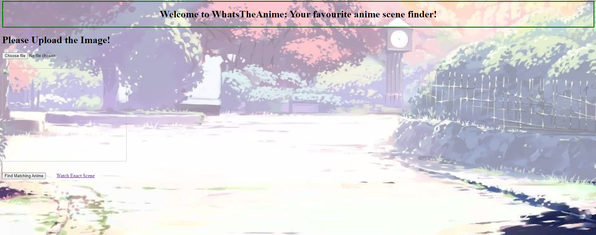
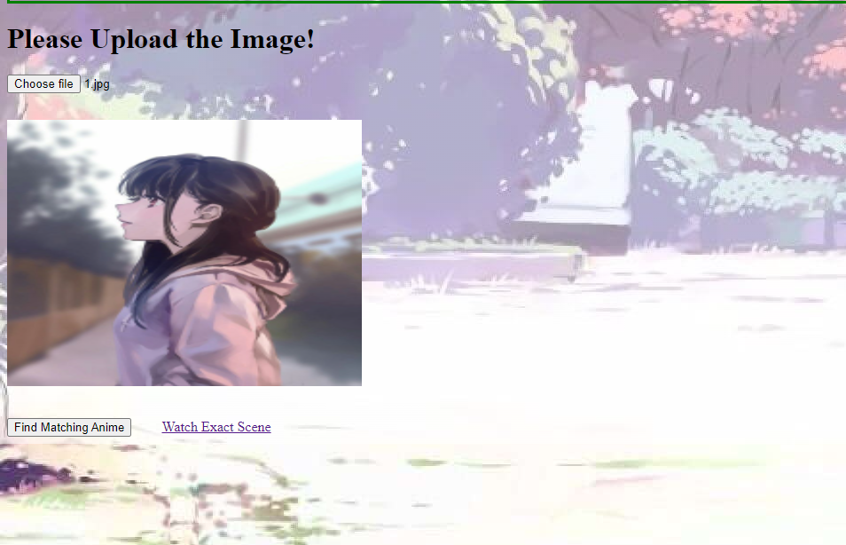
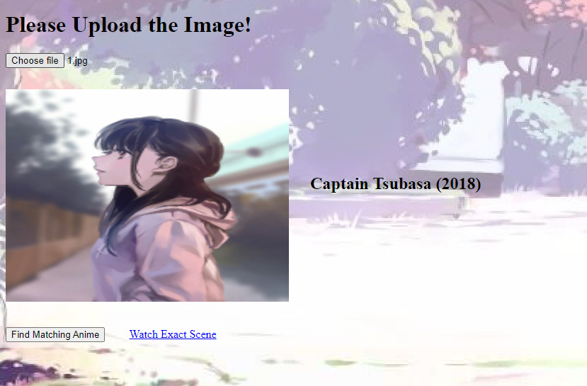

# whatsthisanime
 

     
    Finds The Anime name and the corresponding video fragment

## Raw steps to build.
- Run index.html and follow the steps

## Website looks like the following.

     
    The home page looks like the above.

     
    The user must upload the picture.

     
    The result is displayed like above.

